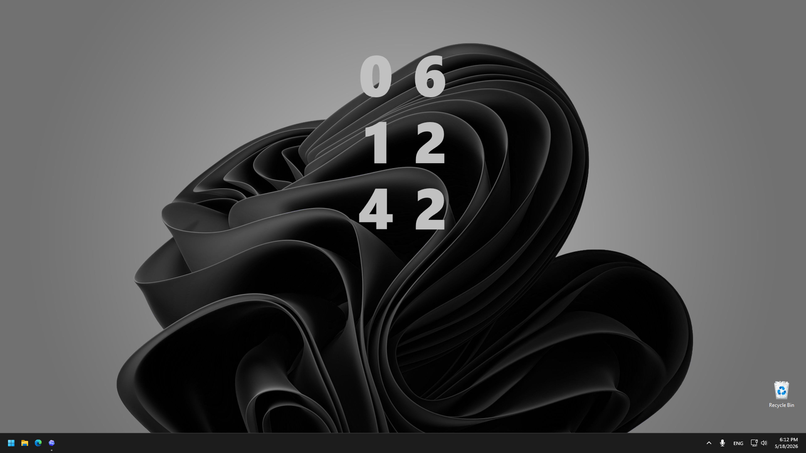
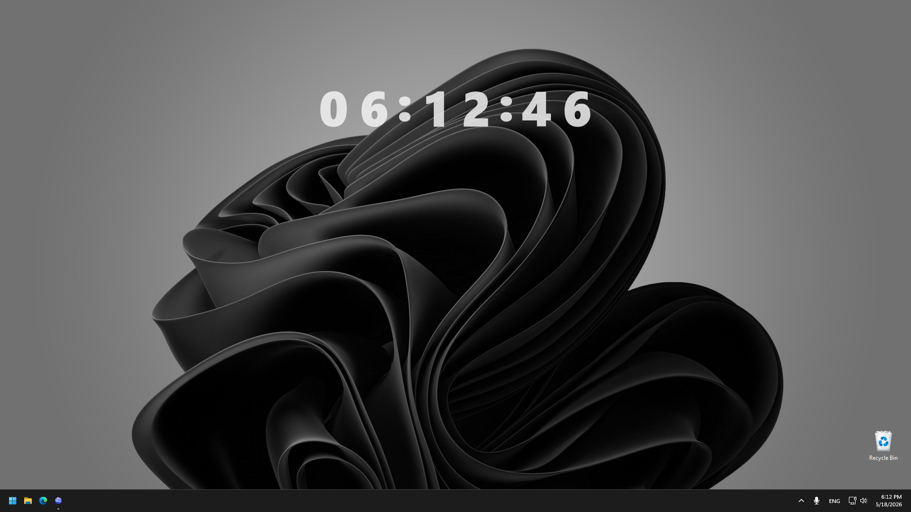
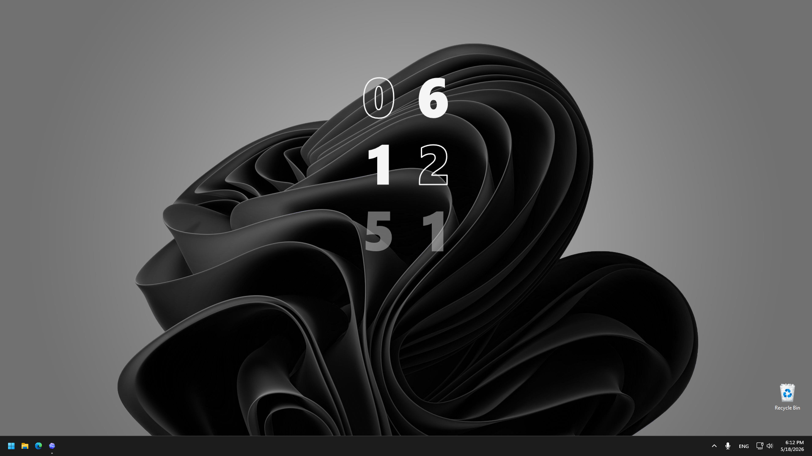
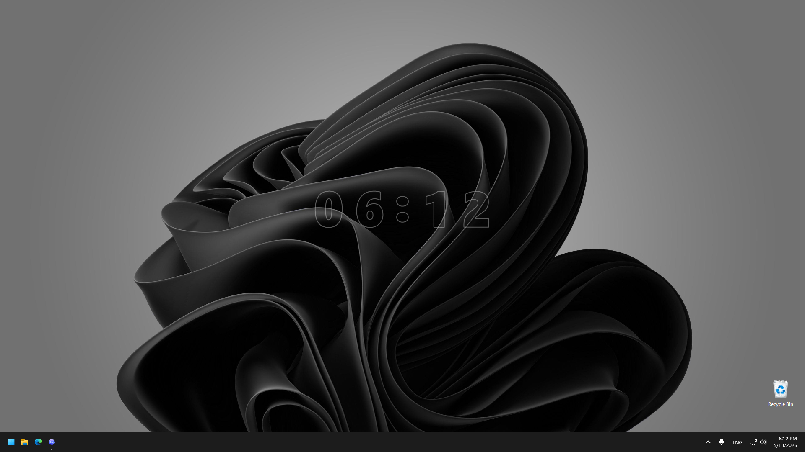

# Desktop Clock

<p align="center">
  
</p>

Desktop Clock is a native Windows desktop overlay clock written in C# and WPF.

It renders a transparent, click-through clock on the desktop and includes a live
editor for positioning, layout, per-digit typography, outline mode, opacity, and
startup behavior.

## Screenshots

### Vertical Desktop Layout



### Horizontal Layout With Separators



### Mixed Filled And Outline Items



### Low Opacity Outline Mode



## Download

Get the latest installer here:

[Download Desktop Clock Installer](https://github.com/Discasa/DesktopClock/releases/latest/download/Desktop.Clock.Installer.exe)

All releases are available on the
[GitHub Releases page](https://github.com/Discasa/DesktopClock/releases).

## Features

- Transparent WPF desktop overlay.
- Horizontal or vertical time layout.
- Optional seconds and separators.
- Per-item font, size, color, render mode, opacity, box size, and offsets.
- Per-item outline, filled, or filled-outline text rendering.
- Live editor preview.
- Windows light/dark theme-aware editor.
- Per-user installer and uninstaller.
- Automatic updates through GitHub Releases.

## Local Build

```powershell
dotnet build .\DesktopClock.slnx -c Release
```

Build the release installer and update package:

```powershell
powershell -NoProfile -ExecutionPolicy Bypass -File .\tools\build.ps1
```

The release assets are written to `release/`.

## Launchers

For source-tree runs:

- `clock.bat` starts the overlay clock.
- `editor.bat` starts the editor.

The installer creates Start Menu shortcuts for both the clock and the editor.
