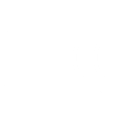

# Desktop Clock

  

  <strong>A clean, customizable clock for your Windows desktop.</strong>

  Put the time directly on your wallpaper, tune every number, and keep your desktop looking exactly the way you want.

  <a href="https://github.com/Discasa/DesktopClock/releases/latest/download/Desktop.Clock.Installer.exe"><strong>Download Now</strong></a>

## Looks

<table>
  <tr>
    <td width="50%"></td>
    <td width="50%"></td>
  </tr>
  <tr>
    <td width="50%"></td>
    <td width="50%"></td>
  </tr>
</table>

## Why Use It

- Lives on your desktop without getting in the way.
- Click-through overlay, perfect for daily use.
- Horizontal, vertical, filled, outline, and transparent styles.
- Per-number font, size, opacity, color, position, outline, bold, italic, and animation control.
- Simple editor with live preview.
- Follows Windows light and dark theme.
- Installs for your user and updates automatically.

## Get It

Download the latest version:

[Desktop Clock Installer](https://github.com/Discasa/DesktopClock/releases/latest/download/Desktop.Clock.Installer.exe)

Need an older version? Check the [Releases page](https://github.com/Discasa/DesktopClock/releases).
